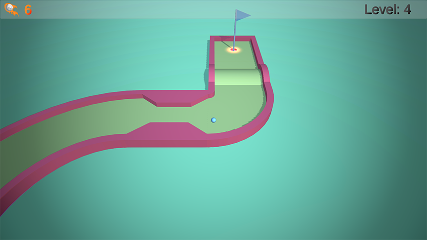

# Mini Golf Game DEMO

## About

This repository contains a simple mini golf game developed in Unity. The objective of the game is to sink the ball into the hole to advance to the next level. You can control the ball's movement by pulling it back and releasing, applying a force based on the distance of the pull.

- [Itch.io](https://gr4ndsmurf.itch.io/g4-mini-golf-demo)

## Gameplay

1. Click and hold the left mouse button to pull the ball backward.
2. Aim for the desired direction by adjusting the pull angle.
3. Release the mouse button to hit the ball with the calculated force.
4. Try to sink the ball into the hole to complete the level.
5. Repeat the process for each level, advancing to higher levels.

## Controls

- Hold the left mouse button: Pull the ball back to control the force.
- Release the left mouse button: Hit the ball in the aimed direction.

## Scripts

### BallMovement.cs

This script is responsible for handling the movement of the ball, including pulling and releasing mechanics.

### CameraMovement.cs

The CameraMovement script ensures the camera follows the ball smoothly during gameplay.

### GameManager.cs

The GameManager script manages the game state, including level completion, click count, and scene loading.

### MenuManager.cs

MenuManager handles the main menu options, allowing players to start the game, exit the application, and open a link to the GitHub repository.

## Sound Effects

- `ballHitSound`: Sound played when the ball is hit.
- `obstacleHitSound`: Sound played when the ball collides with an obstacle.
- `deadzoneSound`: Sound played when the ball enters a dead zone.
- `nextlevelSound`: Sound played when advancing to the next level.

## Credits

- Developed by [gr4ndsmurf](https://github.com/gr4ndsmurf)
- [3D Asset](https://www.kenney.nl/assets/minigolf-kit)
